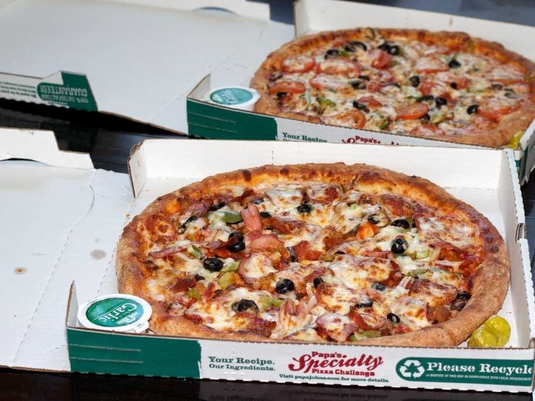

## Satoshi Nakamoto's email

**From**: Satoshi Nakamoto (satoshi@vistomail.com)
**Subject**: Bitcoin P2P e-cash paper
**Newsgroups**: gmane.comp.encryption.general
**Date** Friday 31st October 2008 18:10:00 UTC

I have been working on a new electronic cash system that is fully peer-to-peer, with no trusted third party.

## Pizza for bitcoins?

<!--  -->

**Date:** May 18,2010, 12:35:20 AM

I will pay 10,000 bitcoins for a couple of pizzas.. like maybe 2 large ones so I have some left over the next day. I like having left over pizza to nibble on later. You can make the pizza yourself and bring it to my house or order it for me from a delivery place, but what I'm aiming for is getting food delivered in exchange for bitcoins where I don't have to order or prepare it myself, kind of like ordering a 'breakfast platter' at a hotel or something, they just bring you something to eat and you're happy!

I like things like onions, papers, sausage, mushrooms, tomatoes, pepperoni, etc.. just standard stuff no weird fish topping or anything like that. I also like regular cheese pizzas which may be cheaper to prepare or otherwise acquire.

If you're interested please let me know and we can work out a deal.

Thanks,
Laszlo

Re: Pizza for bitcoins?
May 21, 2010, 07:06:58 PM

So nobody wants to buy me pizza? Is the bitcoin amount I'm offering too low?

Re: Pizza for bitcoins?
May 22, 2010, 07:17:26 PM

I just want to report that I successfully traded 10,000 bitcoins for pizza.
Thanks Jercos!

Medium of exchange: 10,000 Bitcoins for 2 Pizzas.
Value: $20.50 per Pizza
